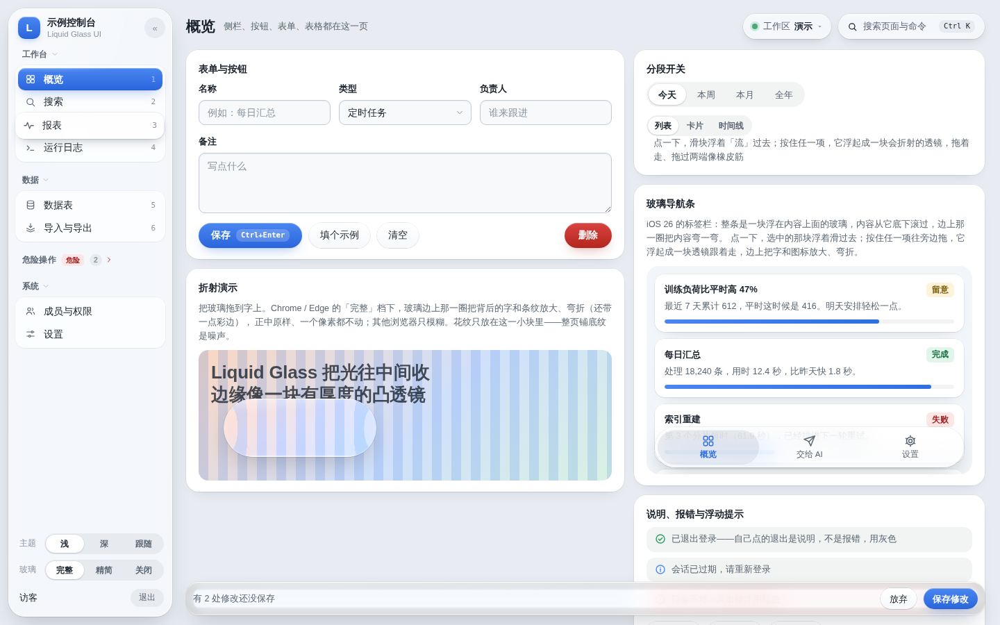
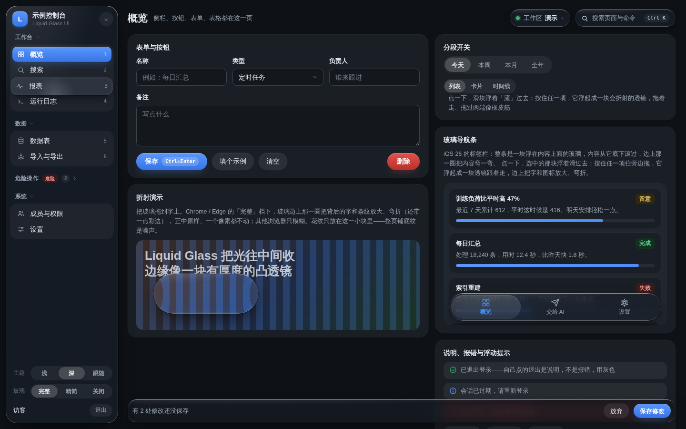
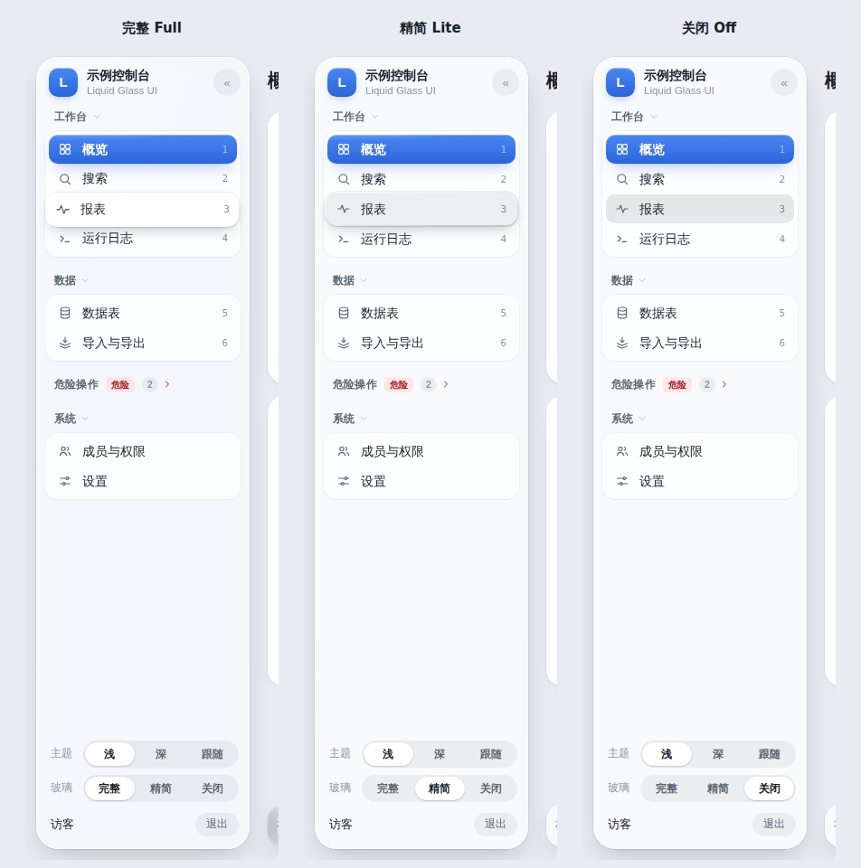
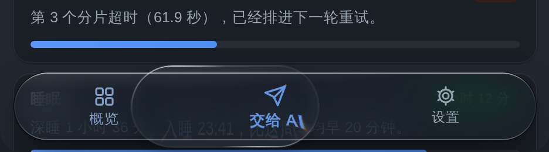
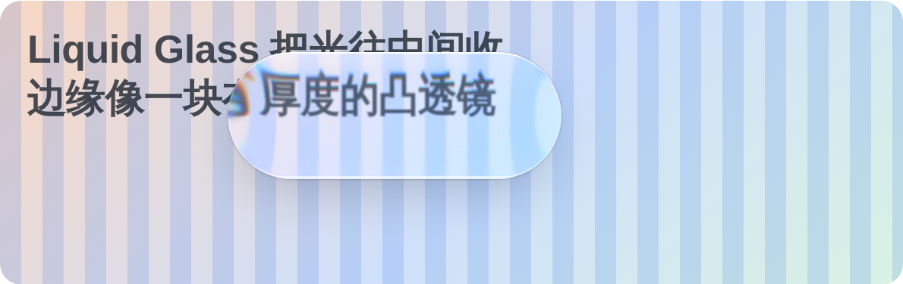

# Liquid Glass UI

一套照 Apple **Liquid Glass（液态玻璃）** 做的网页界面：一个 CSS、一个 ES5 小脚本，不用构建、不依赖任何库、不走 CDN；
同时也是一个可以直接装进 Claude 的 **skill**——对 Claude 说「把这个后台改成液态玻璃风格」，它就照这套定稿来做。



| 深色 | 三档：完整 / 精简 / 关闭 |
|---|---|
|  |  |

| 玻璃导航条：按住「概览」往右拖，浮起的透镜把字和图标放大、弯折 | 折射：边上放大 + 模糊 + 散射，正中原样 |
|---|---|
|  |  |

## 有什么

- **会折射的玻璃**：照 iOS 26 的玻璃边——边上那一圈把背后的内容**放大**、轻微**模糊**、泛一层很淡的乳白（**散射**）和一点彩边（**色散**），正中一个像素都不动。`backdrop-filter` 里挂一条 SVG 滤镜：位移曲线 `0.45·b·(1 − s/b)²` 往里取样、处处不折叠，贴图切成九宫格，尺寸变了只挪不重画。Chrome / Edge 上有，其他浏览器自动退成模糊。
- **按住浮起的分段开关与玻璃导航条**：像 iOS 26 的标签栏，按住任一项，滑块浮起成一块盖在字上面、会折射的清玻璃透镜，飞到手指下面；能拖，拖过两端像橡皮筋，甩一下整条形变再回弹；点别的项时浮着滑过去。另有浮在内容上面的玻璃导航条（`.lg-seg--glass`，图标 + 字）。
- **流动的透镜**：鼠标经过、键盘聚焦时，一颗清玻璃按弹簧物理流到那一项底下，经过的项微微放大、跟手，按下像果冻。
- **液态滑块**：选中项底下那一块前沿先到、后沿后到，中途被拉长、落定回弹。
- **统一的按钮反馈**：悬停浮起 1px + 投影加深 + 跟着指针走的指尖光，按下缩一点。
- **iPadOS「设置」式的分组侧栏**：每组菜单项垫一块圆角底板，一眼看出一项属于哪一组；可折叠成图标轨。
- **三档开关与自动降级**：完整 / 精简 / 关闭，三档肉眼分得出来；远程桌面、虚拟机（软件渲染）、掉帧时自动先不折射；
  跟随系统的「减少动态效果」「减少透明度」「增强对比度」。
- **HDR 高光**：HDR 屏上玻璃上沿一道比页面白更亮的光（16 位 PNG + cICP）。
- **浅色 / 深色 / 跟随系统**，玻璃提示、浮动提示、命令面板、弹出菜单、表格、表单一整套组件。
- **完整的方法**：设计规范、技术原理、40 个踩坑、每轮评审的设计决策、静态检查与截图校验脚本。
  第二版（1.1.0）对照 [ZeppBridge](https://github.com/lingcang728/ZeppBridge/tree/v3) 照 iOS 26 逐帧重做的玻璃改了折射模型、加上了按住浮起，经过见 `references/design-decisions.md` 第八轮。

## 在网页项目里用

1. 把 `liquid-glass-ui/assets/liquid-glass.css` 和 `liquid-glass.js` 拷进项目的静态目录。
2. `<head>` 里引样式表，加一段不闪的内联脚本；`<body>` 最后引脚本：

```html
<html lang="zh-CN">
<head>
  <link rel="stylesheet" href="/static/liquid-glass.css">
  <script>
  (function () {
    var d = document.documentElement, g = null;
    try { g = localStorage.getItem('lg.glass'); } catch (e) {}
    if (g !== 'full' && g !== 'lite' && g !== 'off') { g = 'auto'; }
    d.setAttribute('data-lg-mode', g);
    d.setAttribute('data-lg-tier', g === 'off' || g === 'lite' ? 'l0' : 'l1');
  })();
  </script>
</head>
<body class="lg-page">
  <aside class="lg-glass lg-sidebar">…</aside>
  <button class="lg-btn lg-btn--primary">保存</button>
  <div class="lg-seg"><button aria-pressed="true">今天</button><button aria-pressed="false">本周</button></div>
  …
  <script src="/static/liquid-glass.js"></script>
</body>
```

3. 照 `liquid-glass-ui/assets/demo/index.html` 的结构给元素套上组件类。完整说明见
   [接入指南](liquid-glass-ui/references/integration.md)。

看演示：

```bash
python3 -m http.server -d liquid-glass-ui/assets 8000
# 打开 http://localhost:8000/demo/
```

## 作为 Claude skill 用

**下载安装包**：[Releases 页面](https://github.com/decli/LiquidGlassUI/releases/latest) 里的 `liquid-glass-ui.skill`
（直链：<https://github.com/decli/LiquidGlassUI/releases/latest/download/liquid-glass-ui.skill>）。它是一个 zip，里面就是 `liquid-glass-ui/` 文件夹。

- **Claude Code**：`unzip liquid-glass-ui.skill -d ~/.claude/skills/`（只给某一个项目用，就解到 `项目/.claude/skills/`）
- **claude.ai / Claude 桌面版**：在技能设置里上传这个 `.skill` 文件

也可以直接从仓库拷：

```bash
git clone https://github.com/decli/LiquidGlassUI.git
cp -r LiquidGlassUI/liquid-glass-ui ~/.claude/skills/              # 所有项目都能用
# 或者只给某一个项目：
cp -r LiquidGlassUI/liquid-glass-ui 你的项目/.claude/skills/
```

之后在 Claude 里说「把这个管理页改成液态玻璃风格」「做一个苹果风的侧栏」「加个毛玻璃效果」之类的话，它会自动用上这个 skill。

## 目录

```
liquid-glass-ui/                 ← skill 本体（整个文件夹拷走即可）
├── SKILL.md                     skill 入口：什么时候用、工作流程、不能破的规则
├── assets/
│   ├── liquid-glass.css         令牌 + 玻璃材质 + 组件 + 分档
│   ├── liquid-glass.js          交互层（ES5）：折射、透镜、液态滑块、分段开关的浮起与拖动、指尖光、玻璃提示、HDR、三档
│   └── demo/index.html          完整演示页
├── references/
│   ├── design-spec.md           设计规范（定稿）
│   ├── integration.md           接入指南
│   ├── principles.md            技术原理
│   ├── pitfalls.md              踩坑清单
│   └── design-decisions.md      设计决策记录
└── scripts/
    ├── check.mjs                静态检查（只要 Node）
    ├── shoot.mjs                真浏览器截图 + 三档 / 折射 / 分段开关校验（要 Playwright）
    ├── displacement_map.py      位移贴图 / 静态 SVG 滤镜生成器
    └── hdr_png.py               HDR 高光贴片生成器
design/                          定稿截图（由 scripts/shoot.mjs 拍的）
tools/package_skill.py           把 liquid-glass-ui/ 打成 .skill（与官方 skill-creator 同格式，可复现）
.github/workflows/skill.yml      检查 → 打包 →（推版本标签时）发布到 Releases
```

## 浏览器

| 浏览器 | 效果 |
|---|---|
| Chrome / Edge 90+（及其内核的浏览器） | 全部：模糊 + 边缘折射 + 流动动效；HDR 屏上有 HDR 高光 |
| Safari、Firefox（支持 `backdrop-filter` 的版本） | 模糊 + 高光环 + 流动动效，不折射 |
| 更老的浏览器 | 实色玻璃，动效照常 |
| IE11 | 脚本不执行，样式表给实色兜底；页面照样能用 |

## 改完怎么验

```bash
node liquid-glass-ui/scripts/check.mjs         # ES5、不改 class、令牌一致、类名没拼错
node liquid-glass-ui/scripts/shoot.mjs         # 拍演示页整套截图，并验：三档分得开、每个能点的元素悬停都有反馈、所有玻璃同一种材质、
                                               # 玻璃正中逐像素不动而外圈在弯、分段开关与玻璃导航条按住 / 拖 / 甩 / 橡皮筋都对（需要 Playwright）
python3 liquid-glass-ui/scripts/displacement_map.py --selftest   # 位移曲线不折叠、九宫格拼回去和整张一样
python3 liquid-glass-ui/scripts/hdr_png.py --verify liquid-glass-ui/assets/liquid-glass.js
```

更多截图与说明见 [design/](design/README.md)。

每次推到 `main` 或提 PR，GitHub Actions 都会跑一遍上面这些检查（包括真浏览器的三档校验）并打出 `.skill`，留在那次运行的产物里。

## 发布新版本

1. 把 `liquid-glass-ui/assets/liquid-glass.js` 里的 `version: '…'`，以及 CSS / JS 文件头的版本号，改成新版本（比如 `1.0.1`）。
2. 提交、推到 `main`。
3. 工作流检查通过后，发现 `v1.0.1` 还没有发布过，就自动建好标签和 Release，挂上 `liquid-glass-ui.skill` 与校验和。
   已经发布过的版本不会被覆盖；检查没过就不发布。

也可以推一个 `vX.Y.Z` 标签，或在 Actions 页面手动运行「打包 .skill」并填上标签来发布。
标签和脚本里的版本号对不上时打包会失败，不会发出一个版本号错的包。

本地打包：`python3 tools/package_skill.py liquid-glass-ui dist`。

## 许可

[MIT](LICENSE)。可以自由使用、修改、再分发（包括商用），保留版权声明即可。skill 文件夹里也放了一份 `LICENSE.txt`，单独拷走时许可跟着走。

---

## English

**Liquid Glass UI** is a dependency-free kit (one CSS file + one ES5 script) that brings Apple's Liquid Glass material to web
apps: iOS 26-style edge refraction inside `backdrop-filter` (Chromium) — the rim magnifies, softly blurs, scatters and
disperses what is behind it while the centre stays pixel-exact (a non-folding inward displacement curve on a nine-slice map) —
fluid spring-driven hover lenses, liquid selection sliders, a tab-bar-style segmented control whose thumb lifts into a
refracting lens you can drag (rubber-band ends, flick deformation), pointer-following glow, glass tooltips, HDR highlights,
an iPadOS-style grouped sidebar, and a
Full / Lite / Off switch with automatic fallback on software-rendered GPUs. It is also a Claude skill: copy
`liquid-glass-ui/` into `~/.claude/skills/` and ask Claude to restyle a UI in Liquid Glass. Docs are in Chinese;
the script's built-in messages switch to English when `<html lang>` is not Chinese. MIT licensed.
