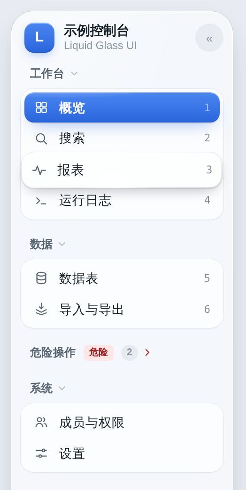
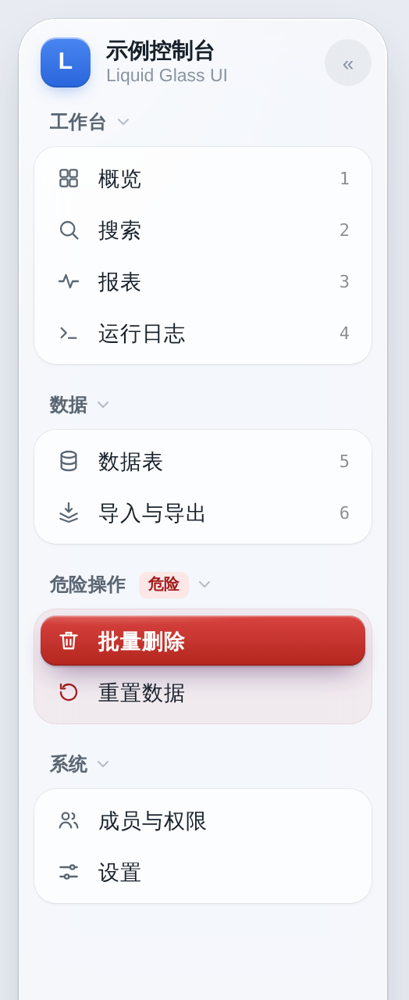
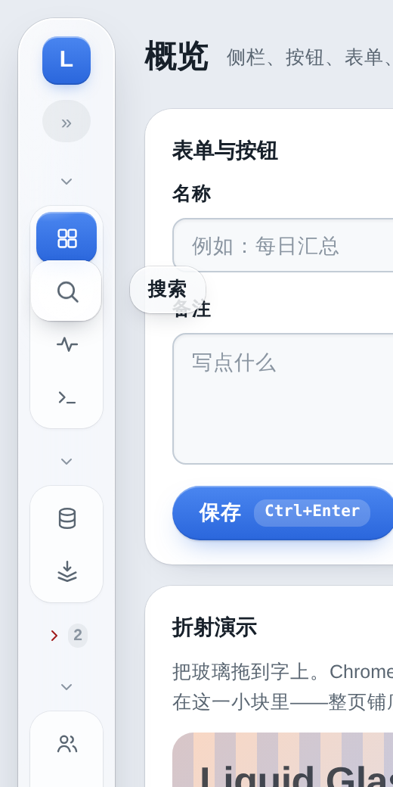
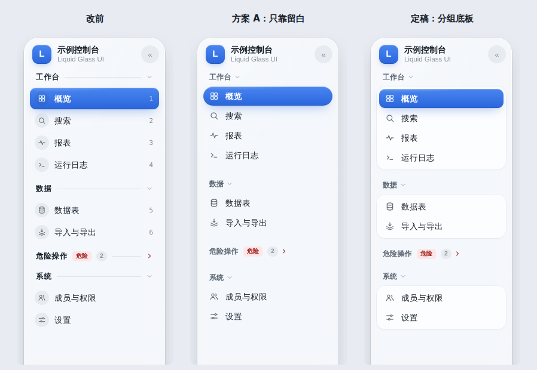
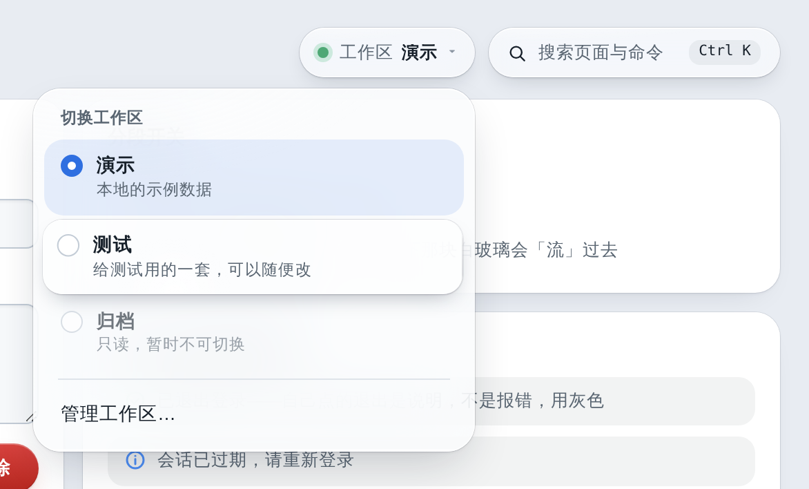
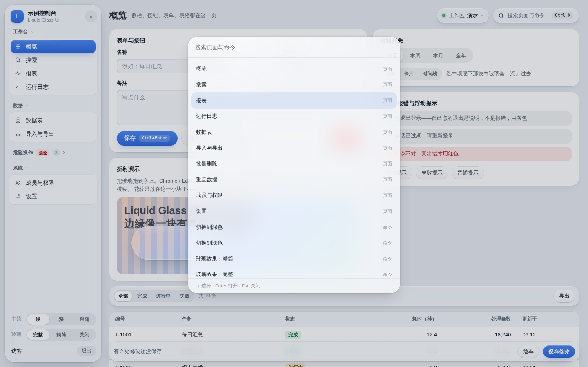
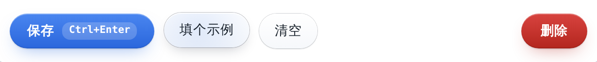
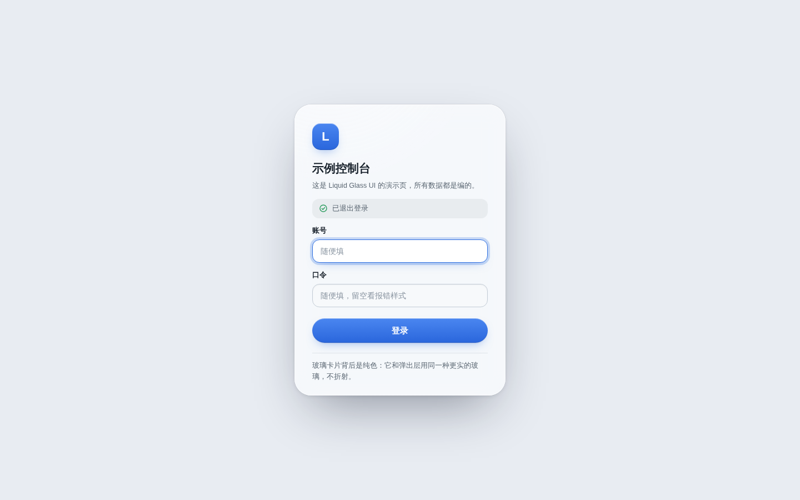
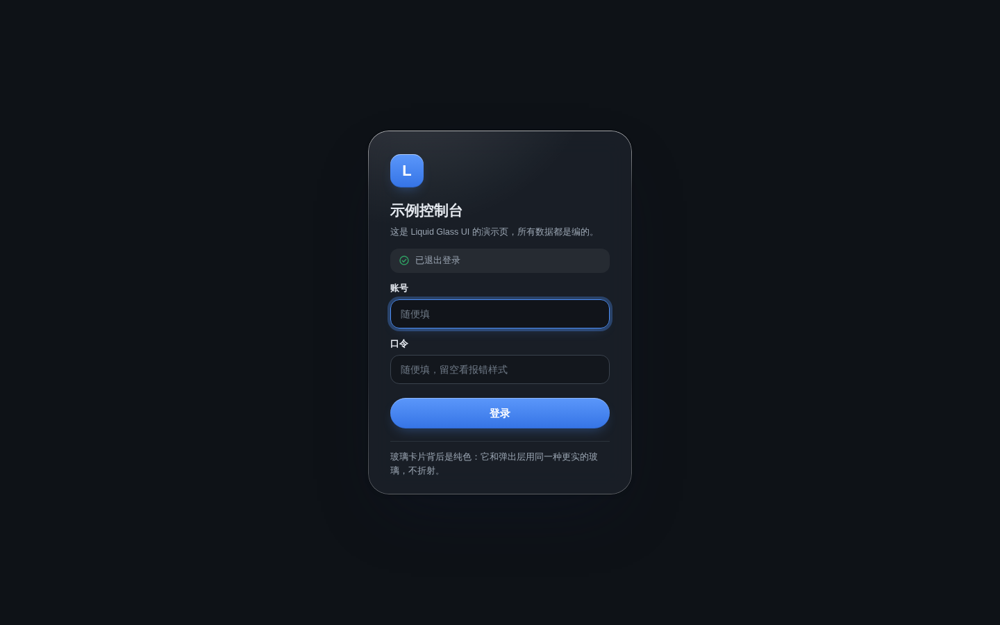

# 定稿截图

全部由 `liquid-glass-ui/scripts/shoot.mjs` 在无头 Chromium 里拍演示页（`liquid-glass-ui/assets/demo/index.html`）得到，
档位事先设成「完整」（无头浏览器是软件渲染，自动档会先不折射）。改了样式想更新这些图：

```bash
node liquid-glass-ui/scripts/shoot.mjs --out design && rm design/mode-*.png
```

演示页里的名称、数据都是编的。

## 整页

| | |
|---|---|
|  |  |
| 浅色。侧栏是一块浮起的玻璃，菜单按组垫底板；鼠标停在「报表」上，一颗清玻璃透镜垫在字底下；底部保存条从表格上方经过，边缘在折射 | 深色。玻璃是烟灰色，高光环收暗，投影加深 |

## 三档


同一个悬停状态（鼠标停在「报表」上）：**完整**——半透明、透镜带跟手的光、项被放大；**精简**——面板实色、透镜直接到位、不放大；
**关闭**——没有透镜与滑块，悬停只叠一层薄暗，选中项画自己的底色。三档必须一眼分得出来（`shoot.mjs` 会在 DOM 与像素两头验）。

## 侧栏

| | | |
|---|---|---|
|  |  |  |
| 透镜垫在字底下，比项大 3px，经过的项放大 2.5%（图标多 8%） | 危险组展开、选中危险项：滑块从蓝交叉淡入成红，危险组的底板带一点红 | 折叠成图标轨：底板照样分组；悬停出玻璃提示，代替浏览器的 `title` 小黄框 |



侧栏分组的演变（详见 `liquid-glass-ui/references/design-decisions.md` 第七轮）：**改前**组标题更黑更粗、圆形图标底连成一根竖柱、
箭头挂在最右边，看不出一项属于哪一组；**方案 A** 只靠留白（macOS 式）；**定稿**每组垫一块圆角底板（iPadOS「设置」式）。

## 弹出层与控件

| | |
|---|---|
|  |  |
| 弹出菜单：更实的玻璃（78%），当前项主色浅玻璃 + 实心单选圈，透镜流到鼠标下的那一项 | 命令面板：遮罩只调暗不模糊；方向键每按一次列表整片重画，光标滑块照样连续地滑；面板边缘折射背后的正文 |



按钮：主操作蓝、危险红、次要白玻璃。鼠标停在「填个示例」上：浮起 1px、投影加深、指尖光带一点主色（白光打在白按钮上看不出来）。


折射演示：一颗几乎不模糊的清玻璃放在字上，边缘像凸透镜一样把背后的字和条纹往里弯。只有 Chromium 能做。

## 登录页

| | |
|---|---|
|  |  |
| 纯色页面底上一张更实的玻璃卡片。「已退出登录」是灰色说明，不是红色报错；开始打字就收掉 | 深色 |
